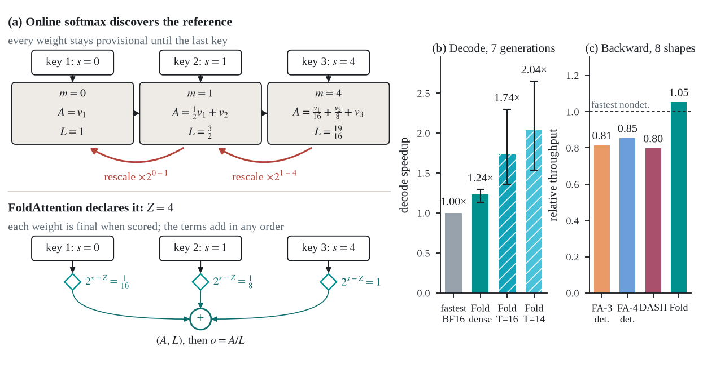
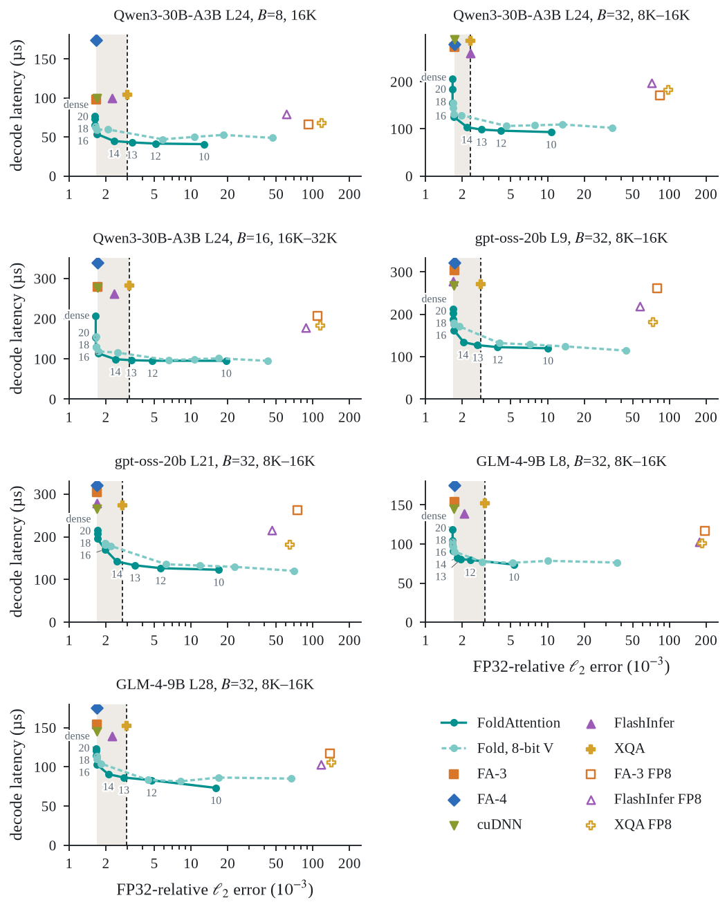
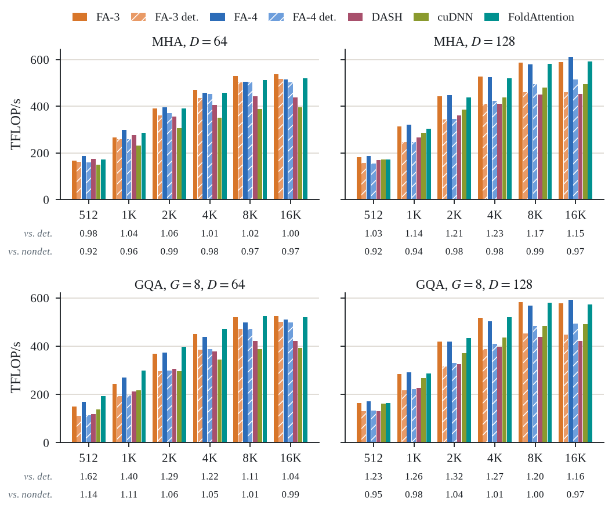

# FoldAttention

<picture>
  
</picture>

FoldAttention declares softmax's reference before execution. Final weights
make decode contributions additive, while a shared integer grid makes the
backward deterministic without serializing its reductions.

## Usage

Install FoldAttention from PyPI:

```bash
pip install fold-attention
```

Install the CUDA 13 dependencies with the `cu13` extra:

```bash
pip install "fold-attention[cu13]"
```

FoldAttention requires Python 3.12 or newer and an NVIDIA SM90 GPU.

## Code usage

### Training

`fold_attn_func` follows FlashAttention's `(batch, seqlen, heads, head_dim)`
layout. Keys and values may use fewer heads for GQA or MQA.

```python
from fold_attention import fold_attn_func

out = fold_attn_func(q, k, v, causal=True)
out.backward(dout)
```

The forward uses FlashAttention-4. The FoldAttention backward produces
bit-identical gradients across repeated runs, batching, and variable-length
packing.

For packed self-attention, pass `(total_tokens, heads, head_dim)` tensors and
a CUDA `int32` cumulative-length vector:

```python
from fold_attention import fold_attn_varlen_func

out = fold_attn_varlen_func(q, k, v, cu_seqlens, causal=True)
```

### Decode

`FoldKVCache` owns one layer's paged cache. `prefill` runs FlashAttention-4
and writes the cache. `fold_attn_with_kvcache` optionally appends one token per
request, then attends over the updated cache.

```python
from fold_attention import FoldKVCache, fold_attn_with_kvcache

cache = FoldKVCache(
    batch=batch_size,
    n_heads=n_heads,
    n_kv_heads=n_kv_heads,
    head_dim=head_dim,
    max_len=max_len,
    depth=16,
)

prompt_out = cache.prefill(q, k, v, cu_seqlens)
step_out = fold_attn_with_kvcache(q_step, cache, k_step, v_step)
```

Set `depth=None` for dense decode. A finite depth cuts low-weight keys while
retaining their normalization mass. Set `v8=True` to store values in two E4M3
planes.

## Benchmarks

### Decode speed and accuracy

Latency against FP32-relative error on seven real-model generations. Each
FoldAttention curve sweeps the decode depth.

<picture>
  
</picture>

### Deterministic backward

Causal backward throughput across MHA and GQA shapes. The rows below each
panel report FoldAttention throughput relative to the fastest deterministic
and nondeterministic kernel.

<picture>
  
</picture>

The benchmark suite and measurement protocol are documented in
[`benchmarks/README.md`](benchmarks/README.md).

## License

FoldAttention is released under the [Apache License 2.0](LICENSE).
